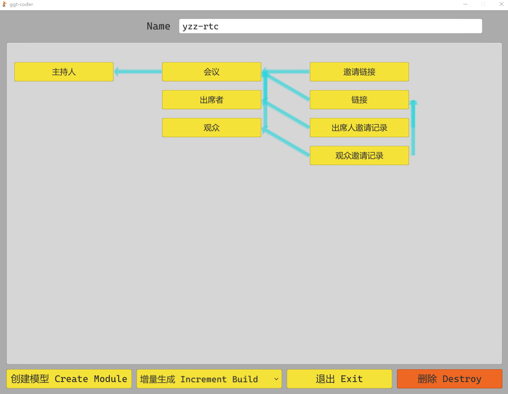

<h1 align="center">罐罐头 Coder</h1>

<h2 align="right">将你从流水线式的编程中解放出来</h2>

翻译:

* [English](../README.md)

## Features
* 可视化设计项目模型关系
* 一键生成项目
* 完整的 laravel 技术栈实现
* 根据字段设计，自动完成以下模块的编写，实现增删改查基础功能的全部流程，为复杂逻辑提供全面的对接空间
    * Model         - 模型文件
    * Observer      - 观察者
    * Resource      - API 资源
    * Collection    - 资源集合
    * Controller    - 控制器
    * Request       - 表单验证
    * Rule          - 表单规则
    * Policy        - 权限
    * Route
    * Migration
    * Seeder
    * Factory
    * Test
    * Docs

## Start

双击 ggt-coder.exe ，就像是打开一款游戏一样，享受编码的过程！

### 设置 Setting
#### 项目作者名称
* 将这一项改为你的名称，以后这个字段将会填入注释当中的 @author 里！
#### 编程语言
* 很抱歉目前仅支持 Laravel 8.12 ,目前修改这一栏不会产生任何效果，以后会加入 Go 语言的一键生成。欢迎其他小伙伴加入我们一起完成这个项目！
#### 模型关系类型
* 众所周知改需求是甲方的传统艺能。有次我在做一个项目，一开始的需求是`一个业务员维护一个合同`，他们的对应关系是 `Salesman HasOne Contract`。 
  这个项目上线运行了好久，甲方突然要我改成 `多个业务员维护一个合同`，他们的模型关系是 `Salesman HasMany Contracts`。
  虽然只是换了一个单词，但是熟悉 `laravel 模型关联`的小伙伴已经知道了，这个改动涉及到新的数据表和多个字段的改动。
  而且甲方还要把合同和公司，联系人的关系由`多对一对多`改为`多对多对多`。
  甲方千不该万不该，甲方给我钱就是我的爸爸。所以出了问题我就要在自己身上反思：如果我在一开始就有一张中间表来`Middle`记录他们的关系，无论甲方怎么改，对我而言都是几个关键字的替换就可以了。 
* 所以就产生了这个`All For Middle`的设计理念。如果你无法适应这样的理念，可以将其改为`Real Relation`，`罐罐头`将忠实的为你生成你设计的模型关联。但我依旧建议你采用`All For Middle`的设计理念。
* 或许你认为多了一张中间表 `Middle`，我的项目“脏了”，它会变得更慢，我想要精益求精，我要设计最快的结构，哪怕以后要面对崩山一般的改动。但是`罐罐头`本就是为了`将你从流水线式的编程中解放出来`而存在的。相信我，省去这些时间去钻研新的技术，你的项目运行效率会取得千百倍的提升，而不是在一两微秒之间打转。
#### 默认字段
* 这些字段会在你创建模型的时候自动加入表中。
* 第一位是`字段描述`， 第二位是`字段名`，第三位是`字段类型`。前两个好理解，`字段类型`将会在之后详细说明，如果有必要的话，您完全可以凭借直觉自行决定修改默认字段。

### 项目列表 Project List
* 就是你的项目列表
* `罐罐头`的数据以`SQLite`的方式保存在本地，只要备份好数据库文件：`.\ggt-coder_Data\ggt-coder.db`，你就可以在任何地方完全重现属于你的`罐罐头`

### 项目内容 Project Content

* 在项目列表界面点击 `新项目` 或者之前的项目，都能进入这个界面。
* 顶部是项目名，建议采用像默认名称那样的 `英文单词 并用 - 连接`。因为域名解析更认可这种格式。
* 主要版面展示了这个项目中你设计的模型关系。模型关系以可视化的形式展示在这里，更好的梳理项目结构和设计思路。
* 你别管可视化做的好看不好看，它现在有个可视化的空间，以后就会有个更好的可视化的空间，对不对？
* 底部按钮分别是 `创建模型`,`完整生成：为你一键生成项目`,`退出`,`删除`

### 模型详情 Module Content